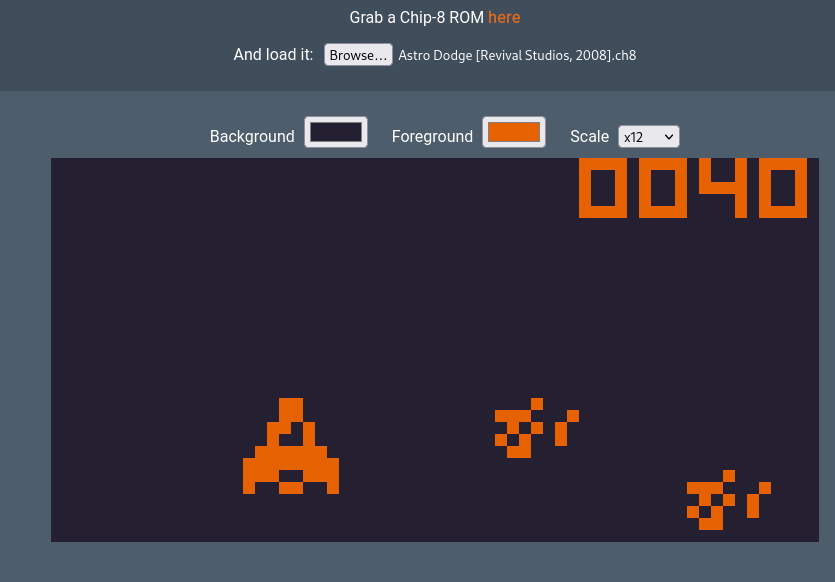

# OitoCore for WebAssembly

Implementation of a web front-end to run the **OitoCore** and complete the emmulator.
This implementation uses the HTML5 canvas and dynamically configurable.



## Running the emulator

To run the emulator you only need to visit the web where it's located and load the ROM:

[https://oito.sotoestevez.dev/](https://oito.sotoestevez.dev/)

In case that you want to customize the canvas running the emmulator you can use the color and scale selector above the canvas.

## Using the emulator

Once the emulator starts, the specified ROM will be loaded and automatically started.
To use the emulator follow you will use the following mapping of the Chip-8 keyboard.

```
+---+---+---+---+         +---+---+---+---+
|   |   |   |   |         |   |   |   |   |
| 1 | 2 | 3 | 4 |         | 1 | 2 | 3 | C |
|   |   |   |   |         |   |   |   |   |
+---+---+---+---+         +---+---+---+---+
|   |   |   |   |         |   |   |   |   |
| Q | W | E | R |         | 4 | 5 | 6 | D |
|   |   |   |   |         |   |   |   |   |
+---+---+---+---+   -->   +---+---+---+---+
|   |   |   |   |         |   |   |   |   |
| A | S | D | F |         | 7 | 8 | 9 | E |
|   |   |   |   |         |   |   |   |   |
+---+---+---+---+         +---+---+---+---+
|   |   |   |   |         |   |   |   |   |
| Z | X | C | V |         | A | 0 | B | F |
|   |   |   |   |         |   |   |   |   |
+---+---+---+---+         +---+---+---+---+
```

### AZERTY and other distributions

Don't worry if you keyboard follows a different distribution than QWERTY. This front-end uses scancodes so what only matters is the key location. Just use the respective keys of your keyboard. For example (with AZERTY), the QWER road would be AZER to use the 4, 5, 6 and D Chip-8 keys.